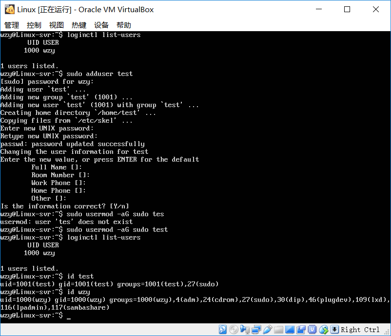
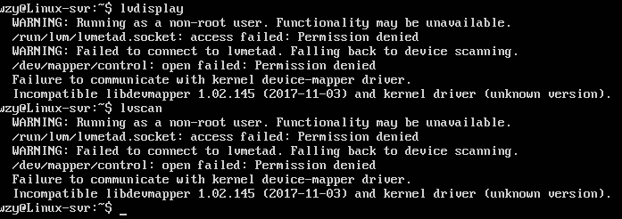

# Systemd开机自启动项管理

## 零.实验背景：

init缺点：启动时间长，启动脚本复杂。

System优点：Systemd使用配置文件的方式更加方便的对自启动项进行管理，而原来的脚本（init.d）方式既不安全也不易于用户进行配置。

## 一.实验环境：

- Ubuntu 18.04 服务器版
- 配置文件Systemd
- Asciinema recorder

## 二.实验步骤：

### A.命令篇：

**3.1-4.2:**

systemctl命令，systemctl-analyze命令，hostnamectl命令， localectl命令，timedatectl命令，loginctl命令，Unit命令

```bash
sudo systemctl [commmand]
```
ps:将系统暂停以后不知道怎么恢复了...

[](https://asciinema.org/a/p5nlrjOsuTMhJnzVtipw4qi5s)

**4.3-4.4:**

unit管理

[](https://asciinema.org/a/X4oAc16OP00pLgepcr9Mxo9l7)

**5.1-6**:

unit配置文件

[](https://asciinema.org/a/Abwb7z3YZSW9zfoVu4jMdEUuj)

**6-7:**

日志管理

[](https://asciinema.org/a/U9VEah35zzG3yfAFfZBp1Bll3)


### B.实战篇：

[](https://asciinema.org/a/ANkWHviEiIbYAMBCPEZZBIA4q)

## 三.自查清单：

- **1.如何添加一个用户并使其具备sudo执行程序的权限？**

  A：使用命令来添加一个具备sudo执行权限的用户：

  ```bash
  sudo adduser UserName
  sudo usermod -aG sudo test
  # 删除用户：
  userdel -r
  ```

  

- **2.如何将一个用户添加到一个用户组？**

  A：使用命令来添加到某一个用户组：

  ```bash
  sudo usermod -aG Group UserName
  ```

- **3.如何查看当前系统的分区表和文件系统详细信息？**

  A：

  查看当前系统的分区表:

  ```bash
   sudo fdisk -l
  ```
  查看文件系统信息:

  ```bash
   df -a [file]
  ```

- **4.如何实现开机自动挂载Virtualbox的共享目录分区？**

  A：

  安装增强功能，在VB界面不选择自动挂载；

  在Windows中新建文件夹/share；

  在linux中新建文件夹：

  ```bash
  mkdir /mnt/shared
  ```

  挂载共享文件夹：

  ```bash
  mount -t vboxsf share /mnt/shared
  ```

  **5.基于LVM（逻辑分卷管理）的分区如何实现动态扩容和缩减容量？**

  A：

  查看系统中的逻辑卷相关信息/扫描逻辑卷：

  ```bash
   lvdisplay/lvscan
  ```

  

  动态扩容：

  ```bash
   lvextend -L <逻辑卷增量> <逻辑卷全路径>
  ```

  动态减容：

  ```bash
   lvreduce -L <逻辑卷减量> <逻辑卷全路径>
  ```

- **6.如何通过systemd设置实现在网络连通时运行一个指定脚本，在网络断开时运行另一个脚本？**

  A：更改/etc/systemd/system/network-online.target.wants/networking.service配置文件下的[Service]部分属性：

  【参考：<https://github.com/CUCCS/linux-2019-zzskin/blob/lab3/lab3/Sytemd%E5%85%A5%E9%97%A8%E5%AE%9E%E9%AA%8C.md>】

  ```bash
  # 在service段添加ExecStartPost,ExecStopPost
  ExecStartPost=/bin/sh -c "echo up"
  ExecStopPost=/bin/sh -c "echo down"
  
  # 重载
  systemctl daemon-reload
  ```

- **7.如何通过systemd设置实现一个脚本在任何情况下被杀死之后会立即重新启动？实现杀不死？**

  A:Restart字段定义了某服务退出后重启的方式，如果将字段设置为always，则总是重启。

  


## 四.参考资料：

<http://www.ruanyifeng.com/blog/2016/03/systemd-tutorial-commands.html>

<http://www.ruanyifeng.com/blog/2016/03/systemd-tutorial-part-two.html>

