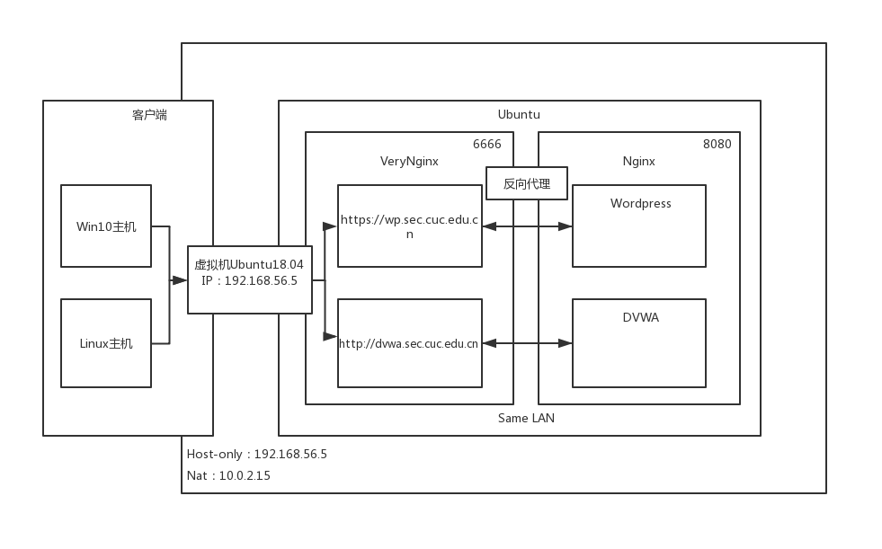
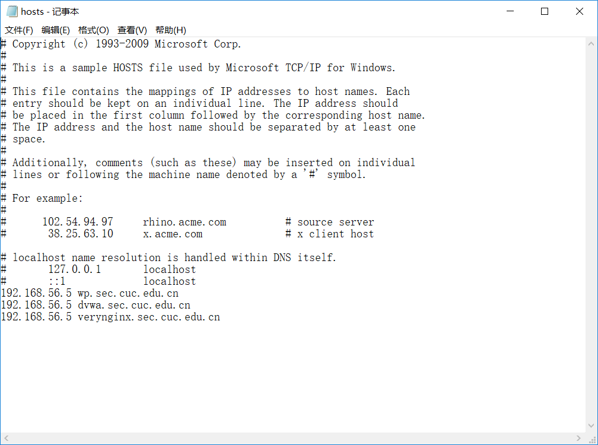
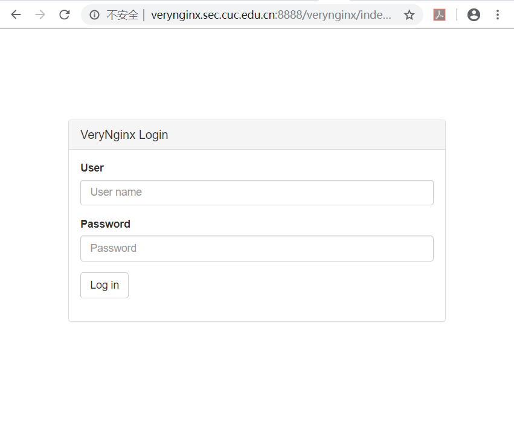
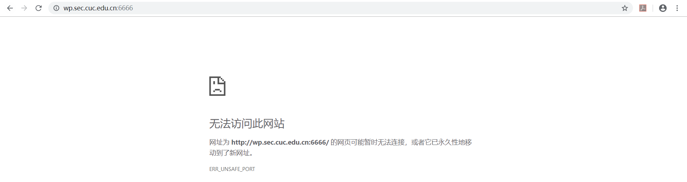

# WEB服务器实验

## 零.环境配置:

### 1.虚拟机/主机配置：

主机环境：Win10

虚拟机环境：Ubuntu18 server版

网卡：Host-only：192.168.56.5

​            Nat：10.0.2.15

虚拟机网络拓扑结构：



### 2.配置Nginx：

安装Nginx：

```shell
# install nginx
sudo apt install nginx
```

启动Nginx：

```shell
# start nginx 
sudo systemctl start nginx
```

默认监听80端口，为了避免冲突，修改为8080端口。

### 3.配置杂项：

修改主机hosts文件使得可以通过域名访问虚拟机ip：


安装MySQL：

```shell
# install mysql
sudo apt install mysql-server
```

安装PHP：

```shell
# install php进程管理器，php-mysql
sudo apt install php-fpm php-mysql
```

修改Nginx配置PHP-FPM进程的反向代理配置在Nginx服务器上，保存退出：

```shell
sudo vim /etc/nginx/sites-enabled/default

     location ~ \.php$ {
         include snippets/fastcgi-php.conf;
          fastcgi_pass unix:/var/run/php/php7.2-fpm.sock;
     }
```

```shell
# 重新启动nginx使配置生效
sudo systemctl restart nginx
```

### 4.配置VeryNginx：

**A.**默认用户名 / 密码: **verynginx / verynginx**

**B.**安装各种依赖：[参考3]

```shell
sudo apt install make
sudo apt install gcc
sudo apt-get install libpcre3 libpcre3-dev
sudo apt-get install libssl1.0-dev
sudo apt install zlib1g-dev
sudo apt install build-essential
sudo apt install lua-rex-pcre
```

VeryNginx提供了python的安装方式，因此需要python3的依赖安装：

```shell
sudo apt install python3
```

**C.**安装VeryNginx：

首先git clone 作者仓库:

<https://github.com/alexazhou/VeryNginx/blob/master/readme_zh.md>(Readme.md)

```shell
# git clone
git clone https://github.com/alexazhou/VeryNginx.git
```

在文件夹中有python的安装文件install.py：

安装过程中，创建文件夹需要`sudo`管理员权限：

```shell
# install VeryNginx
sudo python3 install.py install
```

**D.**安装完成：（启动时关闭防火墙）

```shell
# 启动服务
/opt/verynginx/openresty/nginx/sbin/nginx

# 停止服务
/opt/verynginx/openresty/nginx/sbin/nginx -s stop

# 重启服务
/opt/verynginx/openresty/nginx/sbin/nginx -s reload
```

**E.**VeryNginx配置文件修改：

默认监听端口：80端口 --> 6666端口

用户：nginx



### 5.配置Wordpress：

**A.**下载/安装Wordpress：

解压包依赖：

```shell
# install unzip:
sudo apt install unzip
```

```sh
# download wordpress:
sudo wget https://wordpress.org/wordpress-4.7.zip

# unzip zip:
unzip wordpress-4.7.zip
```

将解压后的wordpress移到指定路径：`/var/www/html/wp.sec.cuc.edu.cn`

```shell
sudo mkdir /var/www/html/wp.sec.cuc.edu.cn
sudo cp -r wordpress /var/www/html/wp.sec.cuc.edu.cn
```

删除压缩包和源文件。

**B.**wordpress在mysql中的数据库：

进入mysql：

```shell
sudo mysql
```

创建数据库：

```sql
CREATE DATABASE wordpress DEFAULT CHARACTER SET utf8 COLLATE utf8_unicode_ci;
```

创建一个新用户，刷新并退出：

```sql
GRANT ALL ON wordpress.* TO 'wpuser'@'localhost' IDENTIFIED BY 'password';
FLUSH PRIVILEGES;
EXIT;
```

**C.**安装PHP相关拓展/重启PHP进程管理器：

```shell
sudo apt install php-curl php-gd php-intl php-mbstring php-soap php-xml php-xmlrpc php-zip
sudo systemctl restart php7.2-fpm
```

**D.**配置Nginx：

```shell
# 修改nginx配置 
sudo vim /etc/nginx/sites-enabled/default

# 将网站根站点修改为wordpress的安装目录 并保存退出
root /var/www/html/wp.sec.cuc.edu.cn;
```

## 一.实验要求：

### 1.基本要求：

1.在一台主机（虚拟机）上同时配置Nginx和VeryNginx

- VeryNginx作为本次实验的Web App的反向代理服务器和WAF
- PHP-FPM进程的反向代理配置在nginx服务器上，VeryNginx服务器不直接配置Web站点服务

2.使用[Wordpress](https://wordpress.org/)搭建的站点对外提供访问的地址为： https://wp.sec.cuc.edu.cn

3.使用[Damn Vulnerable Web Application (DVWA)](http://www.dvwa.co.uk/)搭建的站点对外提供访问的地址为： http://dvwa.sec.cuc.edu.cn

### 2.安全加固要求：

1.使用IP地址方式均无法访问上述任意站点，并向访客展示自定义的**友好错误提示信息页面-1**

2.[Damn Vulnerable Web Application (DVWA)](http://www.dvwa.co.uk/)只允许白名单上的访客来源IP，其他来源的IP访问均向访客展示自定义的**友好错误提示信息页面-2**

3.在不升级Wordpress版本的情况下，通过定制[VeryNginx](https://github.com/alexazhou/VeryNginx)的访问控制策略规则，**热**修复[WordPress < 4.7.1 - Username Enumeration](https://www.exploit-db.com/exploits/41497/)

4.通过配置[VeryNginx](https://github.com/alexazhou/VeryNginx)的Filter规则实现对[Damn Vulnerable Web Application (DVWA)](http://www.dvwa.co.uk/)的SQL注入实验在低安全等级条件下进行防护

### 3.VERYNGINX配置要求

1.[VeryNginx](https://github.com/alexazhou/VeryNginx)的Web管理页面仅允许白名单上的访客来源IP，其他来源的IP访问均向访客展示自定义的**友好错误提示信息页面-3**

2.通过定制VeryNginx的访问控制策略规则实现：

- 限制DVWA站点的单IP访问速率为每秒请求数 < 50
- 限制Wordpress站点的单IP访问速率为每秒请求数 < 20
- 超过访问频率限制的请求直接返回自定义**错误提示信息页面-4**
- 禁止curl访问

## 二.问题/待解决：

在配置Wordpress的时候遇到的问题，还未解决。

访问同一ip的8080端口，可以正常显示VeryNginx的登陆页面，但是访问6666端口的时候拒绝访问，已关闭服务器防火墙。



## 三.参考资料：

1.Github:alexazhou/VeryNginx

<https://github.com/alexazhou/VeryNginx/blob/master/readme_zh.md>

2.<https://github.com/CUCCS/linux-2019-jackcily/blob/job5/job5/%E5%AE%9E%E9%AA%8C5.md>

3.<https://github.com/CUCCS/linux-2019-cloud0606/blob/lab5/lab5/%E5%AE%9E%E9%AA%8C%E6%8A%A5%E5%91%8A.md>