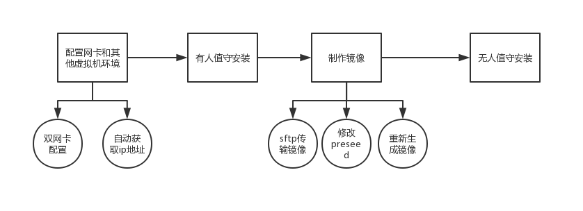
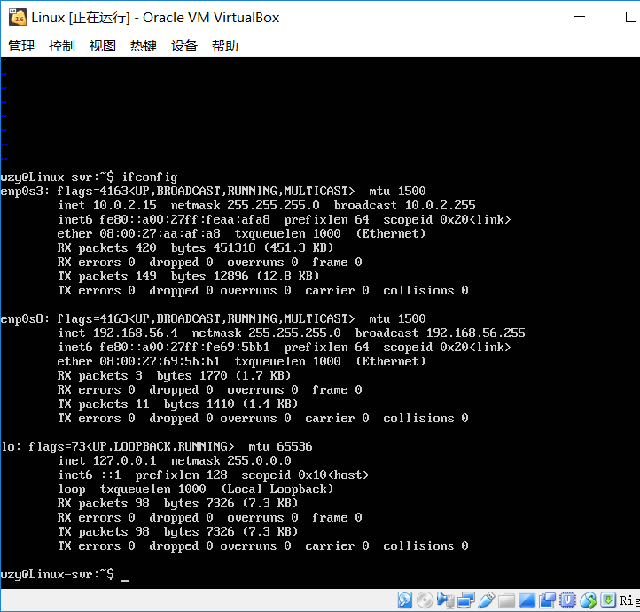
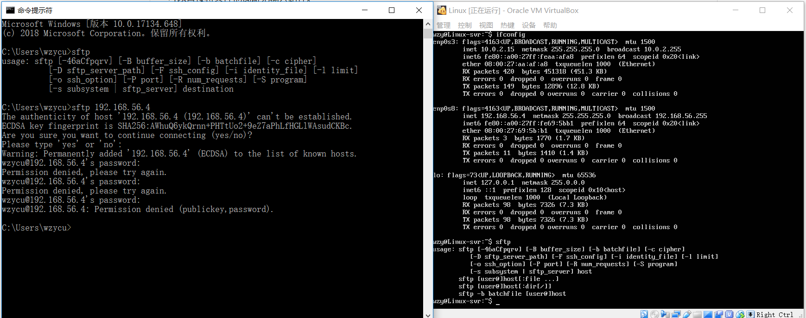
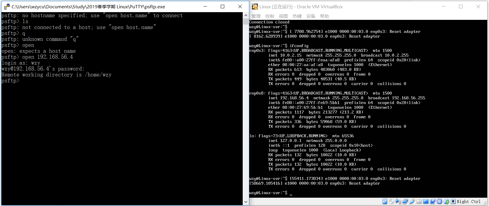
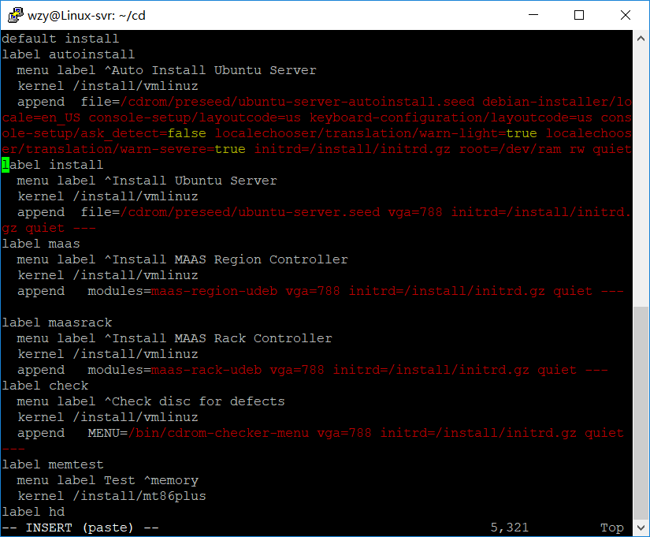
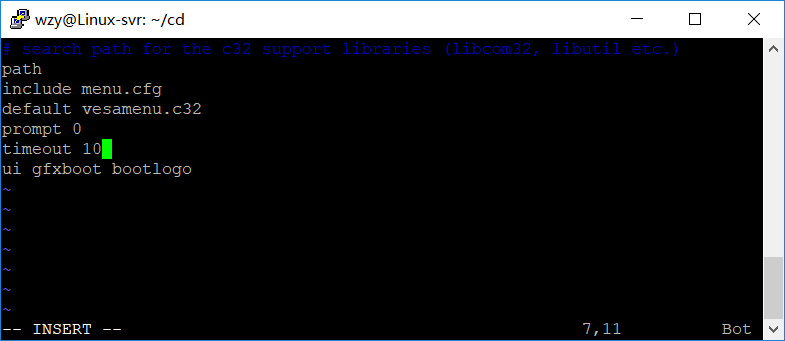
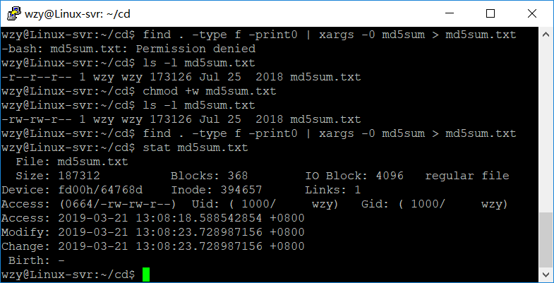
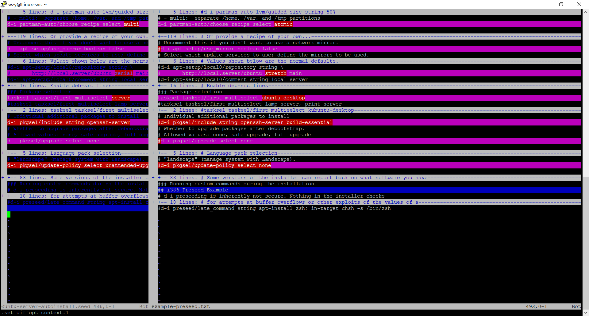

# 无人值守安装Ubuntu镜像

## 零.实验要求/实验问题：

### 要求：

- 定制一个普通用户名和默认密码
- 定制安装OpenSSH Server
- 安装过程禁止自动联网更新软件包

### 问题：

- 如何配置无人值守安装iso并在Virtualbox中完成自动化安装？
- Virtualbox安装完Ubuntu之后新添加的网卡如何实现系统开机自动启用和自动获取IP？
- 如何使用sftp在虚拟机和宿主机之间传输文件？

## 一.安装环境：

- Virtualbox
- Ubuntu 18.04 Server amd64 iso **with Host-only and NAT**
- psftp
- 录屏工具

## 二.安装步骤：

有人值守安装一个可用的ubuntu系统环境（过程省略）。



### 0.添加双网卡

在VB中添加Host-only网卡后，启动linux，查看网卡发现enp0s未启动(ip未分配)，使用命令：

```bash
sudo ifconfig enp0s8 up
```

手动开启网卡，使用：

```bash
sudo dhclient enp0s8
```

自动获取ip地址。如图所示：

**Host-only ：192.168.56.4**

**NAT ： 10.0.2.15**



   ### 1.挂载ubuntu镜像：

使用sftp进行文件传输。

之前遇到的小问题：

一开始打算使用windows cmd中的sftp命令连接ubuntu进行文件传输，但是会显示permission denied：



未解决，遂使用putty中自带的psftp来进行文件传输：



使用的cmd命令：

```markdown
# 根据实际情况，自行替换其中的参数
# 在当前用户目录下创建一个用于挂载iso镜像文件的目录
mkdir loopdir

# 挂载iso镜像文件到该目录
mount -o loop ubuntu-16.04.1-server-amd64.iso loopdir

# 创建一个工作目录用于克隆光盘内容
mkdir cd
 
# 同步光盘内容到目标工作目录
# 一定要注意loopdir后的这个/，cd后面不能有/
rsync -av loopdir/ cd

# 卸载iso镜像
umount loopdir

# 进入目标工作目录
cd cd/

# 编辑Ubuntu安装引导界面增加一个新菜单项入口
vim isolinux/txt.cfg
```

### 2.修改isolinux文件夹下的txt.cfg：

在第二行default下添加：

```bash
label autoinstall
  menu label ^Auto Install Ubuntu Server
  kernel /install/vmlinuz
  append  file=/cdrom/preseed/ubuntu-server-autoinstall.seed debian-installer/locale=en_US console-setup/layoutcode=us keyboard-configuration/layoutcode=us console-setup/ask_detect=false localechooser/translation/warn-light=true localechooser/translation/warn-severe=true initrd=/install/initrd.gz root=/dev/ram rw quiet
```



### 3.修改preseed：

使用老师提供的seed，保存至cd/preseed目录下。

### 4.修改isolinux.cfg：

将timeout 300 改为timeout 10。



### 5.重新生成MD5校验和：

修改md5sum文件的权限，原来只读更改为可写：

```bash
chmod 666 md5sum.txt
```

执行命令：

```bash
cd ~/cd && find . -type f -print0 | xargs -0 md5sum > md5sum.txt
```

重新生成custom.iso：

```bash
IMAGE=custom.iso
BUILD=cd/
sudo mkisofs -r -V "Custom Ubuntu Install CD" \
                        -cache-inodes \
                        -J -l -b isolinux/isolinux.bin \
                        -c isolinux/boot.cat -no-emul-boot \
                        -boot-load-size 4 -boot-info-table \
                        -o $IMAGE $BUILD
```



## 三.课件问题：

定制好的seed和官方事例文件进行对比：

使用vimdiff来进行对比：



```bash
vimdiff ubuntu-server-autoinstall.seed example-preseed.txt
```

使用命令来将不同的行数（上下文）缩短到一行在一页上查看：

```vim
:set diffopt=context:1
```

**1.做了哪些修改？**如图所示。

**2.用什么工具能提高差异对比的效率？**vim。

**3.这些修改的作用是什么？**

原子操作——>多线程操作？（不确定）

（未查到作用）

将版本由桌面版修改为服务器版

将更新政策由空修改为不参与更新

安装build-essential包提供包的依赖信息

## 四.参考资料：

<https://blog.csdn.net/qq_31989521/article/details/58600426>

<https://github.com/CUCCS/linux-2019-cloud0606/blob/lab1/lab1/%E5%AE%9E%E9%AA%8C%E6%8A%A5%E5%91%8A.md>

### 五.视频链接：

<https://www.bilibili.com/video/av46971231/>


